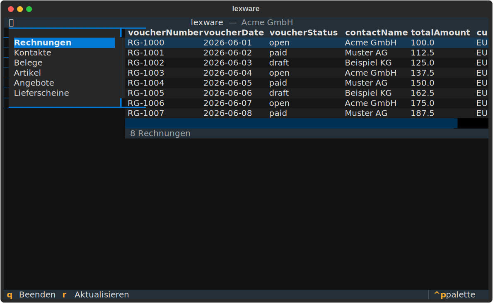

# lxw-cli

Ein Kommandozeilen-Tool für die [Lexware Office API](https://developers.lexware.io/) (vormals lexoffice). Liest Rechnungen, Kontakte, Belege, Artikel, Angebote, Aufträge und Lieferscheine — und legt Drafts neu an.

> **Hinweis:** Inoffizielles Community-Tool — kein Produkt der Haufe-Lexware
> GmbH & Co. KG und nicht mit ihr verbunden. „Lexware" ist eine Marke der
> Haufe Group.

## Features

- Zwei Frontends auf einem UI-freien Core: **CLI** (skriptbar) und **interaktive TUI** (`lxw` ohne Argumente)
- Lesen: `list` (paginiert + Filter), `get` (Detail), `pdf` (Download)
- Schreiben: `create-draft` für Belege (Rechnungen, Angebote, Aufträge, Lieferscheine, Belege), `create` für Stammdaten (Kontakte, Artikel)
- Paginierung: `--limit N`, `--all`/`-a` bzw. `--limit 0` für **alle** Treffer über alle Seiten
- Artikel-Volltextsuche: `articles list --search/-q` (Bezeichnung, Beschreibung, Teil-Artikelnummer)
- Kontakte: `--customer` / `--vendor` (nur Kunden/Lieferanten), optional `--grouped`
- Ausgabe: Tabelle (Rich), JSON (pipe-fähig), CSV, Datei-Output
- PDF-Download nach Datei **oder** Verzeichnis (Auto-Dateiname); `-o` optional
- Komfort: API-Key-Abfrage beim ersten Start, Warte-Animation bei längeren Abrufen
- Eingebauter Rate-Limit-Schutz (2 req/s) + automatische Retries auf 429/5xx

## Installation

Läuft auf **macOS, Linux und Windows** (Python ≥ 3.11). Empfohlen als
isoliertes Tool mit [uv](https://docs.astral.sh/uv/) oder
[pipx](https://pipx.pypa.io/):

```bash
uv tool install lxw-cli      # oder: pipx install lxw-cli
lxw profile
```

Alternativ klassisch in ein Environment:

```bash
pip install lxw-cli
```

### Aus dem Quellcode (Entwicklung)

```bash
git clone https://github.com/markusoeffling/lxw-cli
cd lxw-cli
uv venv && source .venv/bin/activate
uv pip install -e ".[dev]"
```

## API-Key konfigurieren

Lege einen API-Key in deinem Lexware-Account an: <https://app.lexware.de/addons/public-api>

**Einfachste Variante:** Ruf `lxw` einfach auf. Findet das Tool keinen Key,
fragt es im Terminal danach, prüft ihn gegen die API und speichert ihn unter
`~/.config/lexware/.env` (Datei-Rechte `0600`, nur für dich lesbar; unter
Windows `%APPDATA%\lexware\.env`). Ab dann funktioniert `lxw` aus **jedem**
Verzeichnis, ohne weitere Einrichtung.

```bash
lxw profile
# → Kein Lexware API-Key gefunden. Lexware API-Key: ********
# → ✓ API-Key gespeichert in ~/.config/lexware/.env — angemeldet als Acme GmbH
```

Der Key wird in dieser Reihenfolge gesucht:

1. gesetzte Environment-Variable `LEXWARE_API_KEY`
2. projektlokale `.env` (vom aktuellen Verzeichnis aufwärts — praktisch für die Entwicklung)
3. globale `~/.config/lexware/.env` (bzw. `$XDG_CONFIG_HOME/lexware/.env`; unter Windows `%APPDATA%\lexware\.env`)

Wer es manuell vorziehen will, kann den Key auch direkt setzen:

```bash
cp .env.example .env   # projektlokal
# LEXWARE_API_KEY=… eintragen
```

In nicht-interaktiven Kontexten (Pipes, Cron, MCP-Server über stdio) wird **nicht**
gefragt — dort muss der Key vorab über eine der drei Quellen vorhanden sein.

## Quickstart

```bash
# Auth-Test: zeigt Firmenprofil
lxw profile

# Rechnungen (Tabelle) — Standard: 25 Einträge
lxw invoices list --limit 10

# ALLE Rechnungen laden (paginiert automatisch über alle Seiten)
lxw invoices list --all
lxw invoices list --limit 0          # gleichbedeutend

# Archivierte sind standardmäßig ausgeblendet — bei Bedarf einblenden
lxw invoices list --include-archived
lxw contacts list --include-archived

# Rechnungen als JSON in jq pipen
lxw --json invoices list --status open | jq '.[].voucherNumber'

# CSV-Export von Kunden
lxw --csv --output kunden.csv contacts list --customer --limit 200

# Artikel suchen — Teiltreffer in Bezeichnung, Beschreibung und Artikelnummer
lxw articles list --search "schraube"
lxw articles list -q "SCH-"          # auch Teil-Artikelnummern
lxw articles list --number SCH-001   # exakte Artikelnummer (serverseitig, schnell)

# Rechnung per Belegnummer abrufen (UUID auch möglich)
lxw invoices get FB2600682
lxw --json invoices get FB2600682 | jq '.totalGrossAmount'

# PDF einer Rechnung herunterladen (UUID oder Belegnummer)
lxw invoices pdf FB2600682                       # → ./invoice-FB2600682.pdf
lxw invoices pdf FB2600682 --output ~/Rechnungen # Verzeichnis: Dateiname automatisch
lxw invoices pdf FB2600682 --output rechnung.pdf # exakter Dateipfad

# Kontakt anlegen (Stammdaten — kein Draft)
lxw contacts create --body '{
  "roles": {"customer": {}},
  "company": {"name": "Test GmbH"}
}'

# Komplexere Bodies aus Datei
lxw invoices create-draft --body @invoice-template.json
```

## Verfügbare Befehle

| Befehl | Zweck |
|---|---|
| `lxw profile` | Firmenprofil abrufen (Auth-Test) |
| `lxw invoices` | Rechnungen: `list`, `get`, `pdf`, `create-draft` |
| `lxw contacts` | Kontakte: `list`, `get`, `create` |
| `lxw vouchers` | Belege: `list`, `get`, `create-draft` |
| `lxw articles` | Artikel: `list`, `get`, `create` (mit Volltextsuche) |
| `lxw quotations` | Angebote: `list`, `get`, `pdf`, `create-draft` |
| `lxw orders` | Aufträge (Auftragsbestätigungen): `list`, `get`, `pdf`, `create-draft` |
| `lxw delivery-notes` | Lieferscheine: `list`, `get`, `pdf`, `create-draft` |

Hinweis: `create-draft` legt **Belege** als Entwurf an (Draft, nicht finalisiert);
**Stammdaten** (Kontakte, Artikel) kennen keinen Draft-Status und werden mit
`create` direkt angelegt.

Detail-Hilfe mit `lxw <command> --help` bzw. `lxw <command> list --help`.

## Suchen, Filtern & Paginierung

Alle `list`-Befehle teilen sich dasselbe Paginierungs-Verhalten und besitzen
befehlsspezifische Filter. Intern wird serverseitig seitenweise abgerufen —
immer mit dem API-Maximum von 250 Datensätzen/Request (mit Rate-Limit-Schutz),
damit so wenige Requests wie möglich nötig sind.

### Menge: --limit und --all (für jeden `list`-Befehl)

| Option | Wirkung |
|---|---|
| `--limit N`, `-n N` | Maximal N Einträge (Standard: 25). |
| `--limit 0` | Unbegrenzt — lädt **alle** Treffer über alle Seiten. |
| `--all`, `-a` | Wie `--limit 0`; überschreibt ein gesetztes `--limit`. |

```bash
lxw invoices list --all          # alle Rechnungen
lxw contacts list --customer -a  # alle Kunden
```

Am Listenende wird die **Gesamtzahl** der Datensätze ausgegeben (aus dem
`totalElements` der API) — z.B. `→ 25 von 1234 Rechnungen angezeigt (mehr mit
--all)` bzw. `→ 1234 Kontakte gesamt`, wenn alles geladen wurde. Diese Zeile geht
auf **stderr**, stört also `--json`/`--csv`-Pipes nicht. Bei der clientseitigen
Artikelsuche wird stattdessen die Trefferzahl gezeigt (`→ 12 Treffer`).

### Befehlsspezifische Filter

| Befehl | Filter-Optionen |
|---|---|
| `invoices list` | `--status`, `--number` (exakt), `--contact-id`, `--include-archived` |
| `vouchers list` | `--type`, `--status`, `--number` (exakt), `--contact-id`, `--include-archived` |
| `contacts list` | `--name` (≥3 Z.), `--email` (≥3 Z.), `--number`, `--customer`, `--vendor`, `--grouped/--flat`, `--include-archived` |
| `articles list` | `--search`/`-q` (Volltext), `--number` (exakt), `--type product\|service`, `--gtin` (exakt) |
| `quotations list` | `--status`, `--include-archived` |
| `orders list` | `--status`, `--include-archived` |
| `delivery-notes list` | `--status`, `--include-archived` |

`--status` und `--type` sind komma-separiert (z.B. `--status open,paid`).

### Archivierte ausblenden (Standard)

Archivierte Datensätze werden bei **Belegen** (Rechnungen, Belege, Angebote,
Lieferscheine) **und Kontakten** standardmäßig ausgeblendet — `--include-archived`
zeigt sie. Bei Belegen filtert die API serverseitig (`archived=false`), die
Gesamtzahl bleibt also exakt; bei Kontakten geschieht es clientseitig (siehe
unten). Der Footer weist mit `· ohne archivierte (--include-archived zeigt alle)`
darauf hin.

### Kontakte: nur Kunden oder nur Lieferanten

`contacts list` liefert standardmäßig **eine zusammenhängende Liste** (nicht
getrennt — gut für Pipes und Weiterverarbeitung durch LLMs). Auf Wunsch nur eine
Rolle oder optional gruppiert:

```bash
lxw contacts list                    # aktive Kontakte, eine Liste
lxw contacts list --customer         # nur Kunden (serverseitig gefiltert)
lxw contacts list --vendor           # nur Lieferanten (serverseitig gefiltert)
lxw contacts list --grouped          # Tabelle in Kunden-/Lieferanten-Abschnitte
lxw contacts list --include-archived # archivierte Kontakte einblenden
```

Bei `--grouped` zeigt jede Tabelle die passende Kunden- bzw. Lieferantennummer;
Kontakte mit beiden Rollen erscheinen in beiden Abschnitten (`role`-Spalte =
`customer+vendor`). `--json` und `--csv` sind immer eine flache Liste mit
`role`-Spalte.

**Archivierte Kontakte** werden standardmäßig ausgeblendet — `--include-archived`
zeigt sie wieder. Da die Kontakt-API archivierte nicht serverseitig filtern kann,
geschieht das clientseitig: `lxw` blättert durch die Seiten und überspringt
archivierte, bis genug aktive für das `--limit` zusammen sind. Der Footer zeigt
dann z.B. `→ 298 aktive Kontakte gesamt (14 archivierte ausgeblendet)`.

### Artikel-Volltextsuche: --search / -q

Die Lexware-API filtert Artikel serverseitig **nur exakt** (`--number`, `--gtin`,
`--type`). Für unscharfe Suche nach **Bezeichnung, Beschreibung oder
Teil-Artikelnummer** gibt es `--search`/`-q` — dabei werden Artikel clientseitig
durchsucht (Teiltreffer, Groß-/Kleinschreibung egal):

```bash
lxw articles list -q "schraube"        # Bezeichnung/Beschreibung
lxw articles list -q "SCH-"            # Teil-Artikelnummer
lxw articles list --number SCH-001     # exakte Nummer (serverseitig, schnell)
lxw articles list -q "kabel" --type product --all   # kombinierbar
```

Hinweis: `--search` scannt im Zweifel alle Artikel (bricht ab, sobald genug
Treffer für `--limit` gefunden sind). Bei sehr großen Beständen entsprechend
langsamer als die exakten Server-Filter.

## Globale Optionen

| Flag | Zweck |
|---|---|
| `--json` | JSON-Ausgabe (für Pipelines) |
| `--csv` | CSV-Ausgabe |
| `--output PATH`, `-o` | In Datei statt stdout schreiben |
| `--version`, `-V` | Version anzeigen |

## Interaktive TUI

Neben der CLI gibt es eine **Terminal-UI** zum Durchstöbern deiner Daten
(Rechnungen, Kontakte, Belege, Artikel, Angebote, Aufträge, Lieferscheine) —
und zum Anlegen neuer Aufträge als Entwurf.

```bash
lxw            # ohne Argumente im Terminal → TUI startet automatisch
lxw-tui        # oder explizit
```



- Links die Entitäten wählen (Pfeile + Enter), rechts die Liste; **Enter** auf
  einer Zeile öffnet die Detailansicht, **Esc** schließt sie.
- Die Detailansicht zeigt die Felder **menschenlesbar** (deutsche Feldnamen,
  Datumsangaben als TT.MM.JJJJ, ja/nein, verschachtelte Strukturen als Pfad wie
  *Adressen › Rechnungsadresse › Ort*). Mit **j** wechselt man jederzeit auf das
  **rohe JSON** der API und zurück.
- Tastenkürzel: **Tab** Fokus wechseln · **r** aktualisieren · **n** neuer
  Auftrag · **m** mehr laden · **/** suchen · **q** beenden (immer als Leiste
  unten sichtbar).
- **Paginierung**: Jede Liste lädt zunächst eine volle API-Seite (250
  Datensätze — das Server-Maximum pro Request). Scrollt man auf die letzte
  Zeile (oder drückt **m**), wird automatisch der nächste Schwung nachgeladen;
  die Cursor-Position bleibt erhalten. Die Statuszeile zeigt den Stand, z.B.
  `250 von 1234 Rechnungen — ans Ende scrollen oder m lädt mehr`.
- **Suchen** (**/**): öffnet eine Suchleiste über der Tabelle. **Tippen
  filtert sofort** die bereits geladenen Zeilen (clientseitig, über alle
  sichtbaren Spalten). **Enter sucht über die API** — bei Kontakten per Name
  bzw. E-Mail (enthält die Eingabe ein `@`, wird die E-Mail-Suche verwendet;
  min. 3 Zeichen), bei Artikeln per Volltextsuche. In den API-Treffern kann
  anschließend weiter lokal gefiltert werden. **Esc** schließt die Suche und
  stellt die normale Liste wieder her.
- **Auftrag anlegen** (**n**): Kunde per Namenssuche wählen, Artikel suchen und
  mit Menge und (editierbarem) Netto-Einzelpreis als Positionen hinzufügen —
  der Preis wird aus dem Artikel vorbelegt und kann vor dem Hinzufügen
  überschrieben werden. Optional Einleitungs- und Schlusstext eintragen, dann
  *„Auftrag anlegen"* — der Auftrag wird als **Entwurf** gespeichert und die
  Auftragsliste geöffnet. Während Suchen und Anlegen laufen, zeigt das Formular
  eine Lade-Animation. Finalisieren/Versenden bleibt bewusst der Lexware-UI
  vorbehalten.
- Firmenname oben = Verbindungstest; Fehler aus der API werden als Hinweis und
  in der Statuszeile angezeigt (nie verschluckt).

Die TUI startet **nur im interaktiven Terminal**. Sobald `lxw` mit
Argumenten aufgerufen wird oder die Ausgabe in eine Pipe/Datei geht, verhält es
sich unverändert wie die CLI — Skripte und `… | jq` bleiben also unberührt.

Technisch spricht die TUI ausschließlich den UI-freien Core (`lxw_cli.core`)
— exakt dieselbe API wie CLI und MCP-Server.

## Claude-Integration (MCP-Server)

Das CLI bringt einen eingebauten MCP-Server mit, mit dem **Claude Code** (und Claude Desktop) deine Lexware-Daten direkt abfragen kann — analog zum Spark-Mail-CLI von Readdle.

### Setup in einem Schritt

```bash
lxw mcp install-claude
```

Das registriert den Server bei Claude Code (Scope `user`, also für alle Projekte). Der API-Key wird dabei **nicht** an Claude übergeben — der Server liest ihn selbst aus `~/.config/lexware/.env` (chmod 600); falls er dort noch fehlt, legt `install-claude` ihn einmalig ab. Danach:

```bash
claude mcp list   # 'lexware' muss in der Liste erscheinen
```

Öffne Claude Code in einem Projekt und frag z.B.:

> *"Wie viele offene Rechnungen habe ich?"*
> *"Lade die PDF von Rechnung FB2600682 herunter."*
> *"Zeig mir alle Kunden, deren Name mit 'A' anfängt."*

Claude erkennt die Tools automatisch und ruft sie auf.

### Verfügbare MCP-Tools

26 Tools mit identischem Verhalten wie die CLI-Befehle:

- **Lesen**: `profile`, `list_invoices`, `get_invoice`, `download_invoice_pdf`, `list_contacts`, `get_contact`, `list_vouchers`, `get_voucher`, `list_articles`, `get_article`, `list_quotations`, `get_quotation`, `download_quotation_pdf`, `list_order_confirmations`, `get_order_confirmation`, `download_order_confirmation_pdf`, `list_delivery_notes`, `get_delivery_note`, `download_delivery_note_pdf`
- **Belege als Draft anlegen**: `create_invoice_draft`, `create_voucher_draft`, `create_quotation_draft`, `create_order_confirmation_draft`, `create_delivery_note_draft`
- **Stammdaten anlegen** (kein Draft): `create_contact`, `create_article`

Alle document-Tools (`get_*`, `download_*_pdf`) akzeptieren UUID **oder** Belegnummer (z.B. `FB2600682`). PDFs landen in `~/Downloads/lexware/`.

Die `list_*`-Tools bieten dieselben Optionen wie die CLI:

- `limit` begrenzt die Trefferzahl; `limit=0` lädt **alle** (paginiert intern).
- `list_articles` hat `search` für die Volltextsuche (Bezeichnung/Beschreibung/Teil-Artikelnummer) zusätzlich zum exakten `article_number`.
- `list_contacts` filtert mit `customer` / `vendor` nach Rolle.
- Belege-Tools (`list_invoices`, `list_vouchers`, `list_quotations`, `list_delivery_notes`) und `list_contacts` blenden archivierte standardmäßig aus; `include_archived=true` zeigt sie.

### Weitere mcp-Befehle

```bash
lxw mcp status              # zeigt aktuelle Registrierung
lxw mcp install-claude --force   # Re-Install (z.B. nach API-Key-Wechsel)
lxw mcp uninstall-claude    # entfernen
lxw mcp serve               # läuft direkt — wird von Claude Code intern aufgerufen
```

## Out of Scope (v1)

Bewusst nicht enthalten:

- Finalisierung von Rechnungen (`/finalize`)
- Stornierungen / Credit Notes als eigene Workflows
- Webhooks / Event-Subscriptions
- Multi-Account-Profile (nutze stattdessen verschiedene `.env`-Dateien)

## Entwicklung

```bash
uv pip install -e ".[dev]"
pytest -v
ruff check src tests
```

## Lizenz

MIT
